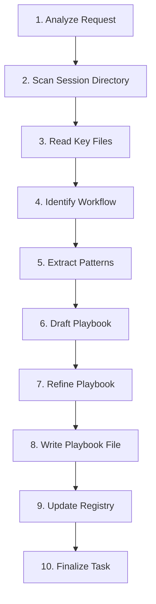

# Playbook: Creating a New Playbook from Session Analysis

**Objective:** Generate a new playbook (`pb_*.md`) by analyzing a specified session directory to extract a reusable workflow.

**Inputs:**

*   `session_path`: Path to the session directory to analyze (e.g., `ai/sessions/YYYY-MM-DD/session_name`).
*   `target_playbook_name`: Desired filename for the new playbook (e.g., `pb_analyze_code.md`). Should follow the `pb_*.md` convention.
*   `target_playbook_objective`: High-level goal of the playbook being created (this will become the Objective section of the new playbook).

## 3. Workflow Diagram

## 4. Steps

1.  **Analyze Request:** Understand the `session_path`, `target_playbook_name`, and `target_playbook_objective` provided as inputs.
2.  **Scan Session Directory:** Use `list_files` (recursive) on the `session_path` to identify relevant files. Look for markdown summaries (`*.md`), logs (`*.log`), source code files, configuration files, or any other artifacts pertinent to the session's task.
3.  **Read Key Session Files:** Use `read_file` to load the content of critical files identified in Step 2. Focus on files that capture the workflow, decisions, tool usage, and final outputs of the session.
4.  **Identify Core Workflow:** Analyze the read content to determine the main sequence of actions, tool usage patterns, key decision points, and information flow within the source session that successfully achieved the original task (related to the `target_playbook_objective`).
5.  **Extract Key Patterns & Steps:** Isolate recurring actions, common tool parameters/sequences, critical decision logic, and essential inputs/outputs that form the core of the reusable process. Generalize specific file paths or examples from the source session into placeholders or descriptions.
6.  **Draft Playbook Structure:** Create the initial content for the new playbook using a standard structure. Populate the sections based on the analysis from Steps 4 & 5:
    *   **Objective:** Use the provided `target_playbook_objective`.
    *   **Inputs:** Define the necessary inputs required to execute the generalized workflow identified in the source session.
    *   **Steps:** Detail the core workflow step-by-step. Include relevant tool calls (e.g., `read_file`, `write_to_file`, `apply_diff`, `execute_command`, `search_files`, `use_mcp_tool`) with generalized parameters or clear examples. Describe key decision points and logic.
    *   **Workflow Diagram Placeholder:** Include a comment like `<!-- MERMAID DIAGRAM TO BE INSERTED HERE -->` where the workflow diagram should eventually go.
    *   **Outputs:** Describe the expected outcome or artifacts produced by successfully following the new playbook.
    *   **Considerations:** Add notes on best practices, potential pitfalls, alternative approaches, or important context observed in the source session.
7.  **Refine Playbook Content:** Review the drafted playbook for clarity, completeness, accuracy, and reusability. Ensure the steps are logical, actionable, and sufficiently generalized. **This refinement phase should also include generating the specific workflow diagram for the new playbook (e.g., using the `diagram` agent based on the drafted steps) and inserting it into the placeholder created in Step 6.** Add other relevant sections if applicable (e.g., Persona, Rules, Tool Descriptions) based on the nature of the playbook being created.
8.  **Write Playbook File:** Use the `write_to_file` tool:
    *   `path`: `ai/playbooks/<target_playbook_name>` (ensure the filename from Inputs is used).
    *   `content`: The complete, refined Markdown content of the new playbook.
    *   `line_count`: The accurate total number of lines in the content.
9.  **Update Playbook Registry (Agent: `document`):** Read the registry file (`ai/playbooks/pb_registry.md`), extract the objective from the newly created playbook (`ai/playbooks/<target_playbook_name>`), format a new entry, append it to the registry content, and write the updated registry file back.
    *   **Inputs:** Path to new playbook (`ai/playbooks/<target_playbook_name>`), Path to registry (`ai/playbooks/pb_registry.md`).
    *   **Outputs:** Updated registry file (`ai/playbooks/pb_registry.md`).
10. **Finalize Task:** Use `attempt_completion`, confirming the successful creation of the new playbook file *and* the update of the registry.

## 5. Outputs

*   A new playbook file located at `ai/playbooks/<target_playbook_name>`, ready for use.
*   Updated playbook registry file (`ai/playbooks/pb_registry.md`) including the new playbook.

## 6. Considerations

*   Complex or lengthy sessions might require iterative analysis and refinement to extract the core playbook logic.
*   Focus on generalizing steps and parameters for broad applicability beyond the specific source session.
*   Ensure any tool parameters or examples included in the new playbook are clear and serve as useful placeholders or illustrations.
*   Consider documenting potential errors, edge cases, or variations encountered in the source session within the Considerations section.
*   The quality of the source session's logs and summaries significantly impacts the ease and accuracy of playbook generation.