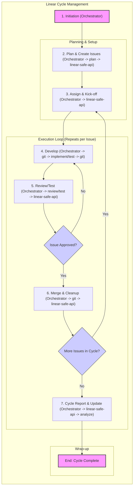

# Playbook: Linear Sprint/Cycle Management with AI Agents

**Version:** 1.0
**Date:** 2025-04-20

## 1. Objective

To provide a structured workflow for an Orchestrator agent to manage a Linear Cycle (or sprint-like iteration) using a team of specialized AI agents, ensuring tasks are planned, executed, tracked in Linear, and reviewed effectively, aligning with Linear's principles of momentum and focus.

## 2. Key Roles/Modes

*   **Orchestrator (e.g., `pb-coordinator`, `implement`):** Manages the overall workflow, assigns tasks to specialist agents, tracks progress, interfaces with Linear via the `linear-safe-api` MCP server, and makes decisions based on agent outputs and Linear state.
*   **Planner (`plan`):** Breaks down high-level goals or epics into specific, actionable Linear issues/tasks with clear descriptions and acceptance criteria.
*   **Implementer (`implement`):** Executes coding, configuration, or other technical tasks based on the specifications in assigned Linear issues.
*   **Tester (`test`):** Creates, executes, and reports on automated or manual tests based on Linear issue requirements and acceptance criteria.
*   **Reviewer (`review`):** Analyzes code changes, configurations, or other outputs associated with Linear issues, providing feedback based on standards and requirements.
*   **Documenter (`document`):** Creates or updates documentation (code comments, READMEs, knowledge base articles) related to completed Linear issues.
*   **Linear Expert (`linear-expert`, Optional):** Provides guidance on Linear best practices, workflow optimization, or feature usage when requested by the Orchestrator.
*   **Git Agent (`git`):** Manages Git operations (branching, committing, merging, PR creation) ensuring linkage to Linear issues.

## 3. Inputs

*   **Cycle Goal(s):** Clearly defined objectives for the iteration (e.g., "Launch user profile V1," "Improve API performance by 15%").
*   **Linear Context:**
    *   Target Team ID (e.g., `6fa56ccd-cf8c-427c-9403-0e38b11eedaf` for Agents team).
    *   Relevant Project ID(s) (e.g., `410a4a04-8a8f-467f-a78a-0bc99aacac74` for magic-api).
*   **Codebase Access:** Path to the relevant Git repository.
*   **Tool Access:** Configured `linear-safe-api` MCP server.

## 4. Workflow Diagram

## 5. Steps

