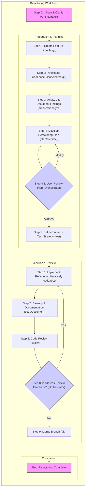

# Playbook: Codebase Refactoring Workflow

**Version:** 1.0
**Date:** 2025-04-09

## 1. Objective

To systematically refactor a specified section of a codebase to improve its quality (e.g., readability, maintainability, performance, security) while ensuring existing functionality is preserved, following a structured, multi-agent workflow integrated with Git best practices.

## 2. Inputs

*   **Initial Request:** User request specifying the codebase location, the target area(s) for refactoring, and the high-level goals (e.g., "Refactor the payment processing module to reduce complexity," "Improve performance of the reporting API endpoint," "Address code smells identified in `UserService.java`").
*   **Codebase Access:** Path to the relevant Git repository.
*   **(Optional) Specific Refactoring Targets:** Pre-identified code smells, anti-patterns, or specific methods/classes to focus on.
*   **(Optional) Existing Analysis:** Any prior static analysis reports, profiling data, or documentation related to the target area.
*   **(Reference) Orchestrator SOPs:** `ai/context/orchestrator_SOPs.md` for Git branching and workflow standards.
*   **(Reference) Playbook Examples:** `ai/playbooks/pb_create_playbook.md`, `ai/playbooks/pb_iterative_execution_verification.md`.

## 3. Workflow Diagram

## 4. Steps

| Step | Agent Mode      | Action                                                                 | Inputs                                                                                                                               | Outputs                                                                                                                                                              | Git Action                                                                                                                                                                                                                            |
| :--- | :-------------- | :--------------------------------------------------------------------- | :----------------------------------------------------------------------------------------------------------------------------------- | :------------------------------------------------------------------------------------------------------------------------------------------------------------------- | :------------------------------------------------------------------------------------------------------------------------------------------------------------------------------------------------------------------------------------ |
| 0    | **Orchestrator**| **Initiate & Clarify:** Receive request, parse inputs. If ambiguity exists, switch to `ask` mode to clarify scope, goals, or target areas with the user. | Initial Request, Codebase Access, (Optional Inputs)                                                                                  | Confirmed/Clarified Request & Inputs                                                                                                                                 | N/A                                                                                                                                                                                                                                   |
| 1    | `git`           | **Create Feature Branch:** Based on confirmed goals and SOPs, create a dedicated feature branch from the main development line (e.g., `main`, `develop`). | Confirmed Request, Codebase Access, Orchestrator SOPs (`ai/context/orchestrator_SOPs.md`)                                                | Name of the created feature branch. Confirmation that the branch is created and checked out.                                                                         | `git checkout <base_branch>`, `git pull`, `git checkout -b refactor/<short-description>`                                                                                                                                             |
| 2    | `scan`, `search`, `git` | **Investigate Codebase:** Perform static analysis (linting, complexity), dependency analysis, pattern searching, and review Git history within the target scope. | Codebase Access (on feature branch), Target Area Scope, (Optional) Existing Analysis                                                 | Raw analysis results (lint errors, complexity scores, dependency list, code snippets with patterns, high-churn files). List of files/areas needing closer examination. | `git log --stat <path>`, `git blame <file>` (as needed)                                                                                                                                                                               |
| 3    | `architect`, `analyze` | **Analyze & Document Findings:** Synthesize investigation results, identify root causes, quantify issues, visualize structure (if needed), and prioritize refactoring candidates. | Raw analysis results (from Step 2)                                                                                                   | Technical Analysis Report (`analysis.md`), Diagrams (optional), Prioritized list of Refactoring Candidates.                                                              | N/A                                                                                                                                                                                                                                   |
| 4    | `plan`, `architect` | **Develop Refactoring Plan:** Define specific goals, scope, target state, sequence of changes, techniques, risks, rollback strategy, and validation criteria. | Technical Analysis Report, Refactoring Candidates (from Step 3), Confirmed Request                                                   | Detailed Refactoring Plan (`refactor_plan.md`)                                                                                                                       | N/A                                                                                                                                                                                                                                   |
| 4.1  | **Orchestrator**| **Review Plan with User:** Present the `refactor_plan.md` to the user for review and approval. Switch to `ask` mode if modifications are requested. Loop back to Step 4 if needed. | Refactoring Plan (`refactor_plan.md`)                                                                                                | User Approval or Modification Requests. Approved/Updated Refactoring Plan.                                                                                           | N/A                                                                                                                                                                                                                                   |
| 5    | `test`          | **Define/Enhance Test Strategy:** Assess existing test coverage. Define strategy (Characterization, TDD, Unit, Integration, E2E) and plan for writing/updating tests based on the Refactoring Plan. | Approved Refactoring Plan, Codebase Access (on feature branch), Target Area Scope                                                    | Test Strategy Document/Section in Plan, List of required new/updated tests.                                                                                          | N/A                                                                                                                                                                                                                                   |
| 6    | `code`, `test`  | **Implement Refactoring (Iterative):** Apply refactoring techniques in small, logical steps as defined in the plan. Write/update tests *before or alongside* changes. Run tests frequently. | Approved Refactoring Plan, Test Strategy, Codebase Access (on feature branch)                                                        | Modified source code files, New/updated test files, Passing test results after each step.                                                                            | `git add <files>`, `git commit -m "Refactor: <specific change description>"` (after each small, validated step). `git push origin <branch-name>` (periodically).                                                                       |
| 7    | `code`, `document`| **Cleanup & Documentation:** Remove dead code, format code, update code comments, READMEs, and other relevant documentation. Remove temporary artifacts. | Refactored Codebase (on feature branch), Approved Refactoring Plan                                                                   | Cleaned source code, Updated documentation files.                                                                                                                    | `git add <files>`, `git commit -m "Refactor: Cleanup and documentation update"`                                                                                                                                                       |
| 8    | `review`        | **Code Review:** Analyze the changes on the feature branch against the plan, coding standards, and best practices. Provide feedback. | Feature branch name, Refactoring Plan, Codebase Access                                                                               | Code Review Report/Feedback.                                                                                                                                         | N/A (Reviewer might add comments on the PR/MR platform)                                                                                                                                                                               |
| 8.1  | **Orchestrator**| **Address Review Feedback:** If feedback requires changes, coordinate with `code`/`test`/`document` agents to implement fixes. Loop back to Step 6/7 as needed, then re-trigger Step 8. | Code Review Feedback                                                                                                                 | Updated code/tests/docs addressing feedback.                                                                                                                         | `git add <files>`, `git commit -m "Refactor: Address review feedback - 
"` (for each feedback item addressed). `git push origin <branch-name>`.                                                                              |
| 9    | `git`           | **Merge Branch:** Once review is approved and all checks pass, merge the feature branch into the target base branch according to project SOPs (e.g., via Pull Request/Merge Request). | Approved Feature Branch Name, Target Base Branch Name, Orchestrator SOPs                                                             | Confirmation of successful merge. (Optional) Deletion of the feature branch.                                                                                         | `git checkout <target_branch>`, `git pull`, `git merge --no-ff <feature_branch>` (or via PR/MR process), `git push`, `git branch -d <feature_branch>` (optional, local), `git push origin --delete <feature_branch>` (optional, remote) |

## 5. Outputs

*   **Refactored Code:** The codebase section modified according to the approved plan, merged into the target branch.
*   **Updated Tests:** New or modified tests ensuring the behavior of the refactored code.
*   **Technical Analysis Report (`analysis.md`):** Documentation of the initial findings (generated in Step 3).
*   **Refactoring Plan (`refactor_plan.md`):** The detailed plan guiding the execution (generated in Step 4, potentially updated in Step 4.1).
*   **Updated Documentation:** Code comments, READMEs, or other documents reflecting the changes (updated in Step 7).
*   **Git History:** A clean, traceable history of changes on the feature branch and the final merge commit.
*   **(Optional) Code Review Report:** Feedback provided during the review phase (generated in Step 8).

## 6. Considerations

*   **Scope Management:** Refactoring can uncover deeper issues. Stick to the agreed-upon scope defined in the plan. New issues should be documented for separate efforts.
*   **Testing is Crucial:** Insufficient test coverage significantly increases the risk of introducing regressions. Prioritize improving test coverage before or during refactoring complex/critical areas.
*   **Iterative Approach:** Break down large refactorings into smaller, manageable, and testable steps. Commit frequently after each validated step.
*   **Team Communication:** If working in a team environment, ensure communication about the ongoing refactoring to avoid significant merge conflicts. Keep the feature branch updated with the target branch frequently.
*   **Tooling:** Ensure appropriate static analysis, testing, and refactoring tools for the specific language/framework are available and configured.
*   **Performance:** Refactoring *can* impact performance (positively or negatively). If performance is critical, establish baselines and measure after refactoring.
*   **Rollback:** While the goal is to avoid it, have the `refactor_plan.md` outline the strategy for reverting changes (usually via `git revert` on the merge commit or resetting the feature branch before merge if major issues are found early).