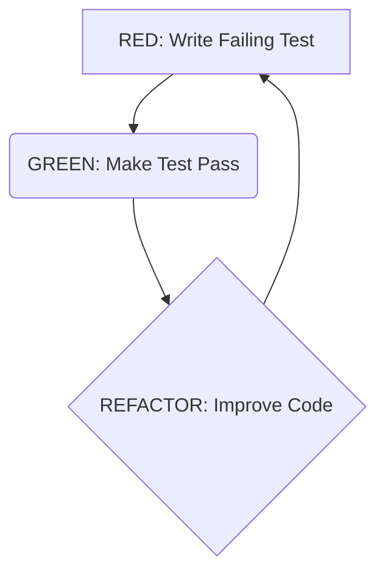

# Playbook: Test-Driven Development (TDD) Cycle

**Version:** 1.0
**Date:** 2025-04-11
**Author:** AI Documentation Agent

## 1. Objective

To guide developers through the core Test-Driven Development (TDD) Red-Green-Refactor cycle, enabling them to build robust, well-tested software incrementally. This playbook aims to establish a consistent process for writing tests before functional code, ensuring code quality, maintainability, and developer confidence.

## 2. Inputs

*   **Requirement/Feature:** A clear understanding of the specific piece of functionality or behavior to be implemented or modified.
*   **Development Environment:** A configured environment with a testing framework suitable for the project's language (e.g., JUnit, pytest, Jest, NUnit).
*   **(Optional) Test List:** A pre-brainstormed list of test cases or behaviors for the feature.

## 3. Steps

The TDD cycle consists of three distinct phases, repeated for each small increment of functionality:

### 3.1. RED Phase: Write a Failing Test

*   **Goal:** Define the *next* desired behavior with a test.
*   **Action:**
    1.  Identify the smallest, next piece of functionality to implement.
    2.  Write a single, automated test case that specifies the expected outcome or behavior for that functionality.
    3.  Focus on *what* the code should do, not *how*. Define the interface and expected results.
    4.  Run the test(s).
*   **Expected Outcome:** The newly added test **must fail** (RED), confirming that the functionality is not yet implemented or is incorrect. This failure clearly defines the goal for the next phase.
*   **Tip:** Start with the simplest possible test case that fails.

### 3.2. GREEN Phase: Make the Test Pass

*   **Goal:** Implement the functionality just enough to pass the failing test.
*   **Action:**
    1.  Write the **absolute minimum** amount of functional code required to make the *single failing test* from the RED phase pass.
    2.  Focus solely on satisfying the test's conditions. Do not optimize or over-engineer at this stage. "Fake it" if necessary (e.g., return a hardcoded value) just to get the test to pass quickly.
    3.  Run the test(s) frequently.
*   **Expected Outcome:** The specific failing test now passes (GREEN), along with all previously passing tests. This indicates the desired behavior is minimally implemented.

### 3.3. REFACTOR Phase: Improve the Code

*   **Goal:** Clean up the code (both production and test code) while ensuring all tests remain green.
*   **Action:**
    1.  Examine the code written in the GREEN phase and existing code related to the change.
    2.  Improve the internal structure, clarity, and design. Remove duplication, enhance readability, apply design patterns, and optimize if necessary.
    3.  Refactor test code for clarity and maintainability as well.
    4.  Ensure the code's *observable behavior* does not change.
    5.  Run all tests frequently during refactoring.
*   **Expected Outcome:** The code is cleaner, more maintainable, and better designed, and **all tests still pass** (GREEN). The system is ready for the next TDD cycle or the feature is complete.

### 3.4. Repeat

*   Return to the RED phase for the next piece of functionality or test case. Continue the cycle until the feature is fully implemented according to requirements.

## 4. Outputs

*   **Functional Code:** Working code that implements the desired feature or behavior.
*   **Comprehensive Test Suite:** A suite of automated tests that verify the functionality and serve as a regression safety net.
*   **Improved Design:** Code that is generally more modular, decoupled, and maintainable due to the incremental design process.
*   **Executable Documentation:** Tests that document the intended use and behavior of the code.

## 5. Considerations & Best Practices

*   **Small Steps:** Keep the cycles short and focused on one specific behavior at a time.
*   **Run Tests Frequently:** Integrate running tests into your workflow constantly.
*   **Refactor Ruthlessly:** Do *not* skip the Refactor phase. This is crucial for managing technical debt.
*   **Test Behavior, Not Implementation:** Write tests against the public interface/contract, not internal details, to avoid brittle tests.
*   **Keep Tests Fast:** Slow tests discourage frequent execution. Use mocks/stubs for dependencies.
*   **Independence:** Ensure tests can run independently and in any order.
*   **Clean Check-ins:** Only commit code when all tests are passing.
*   **Context Matters:** Understand that TDD is a design technique; apply it thoughtfully where it provides the most value (e.g., complex logic, core domain).