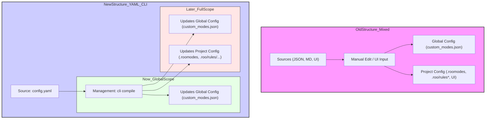

```mermaid
graph TD
    subgraph OldStructure [OldStructure_Mixed]
        direction LR
        Old_Source["Sources (JSON, MD, UI)"]
        Old_Manage["Manual Edit / UI Input"]
        Old_Global["Global Config (custom_modes.json)"]
        Old_Project["Project Config (.roomodes, .roo/rules*, UI)"]

        Old_Source --> Old_Manage
        Old_Manage --> Old_Global
        Old_Manage --> Old_Project
    end

    subgraph NewStructure [NewStructure_YAML_CLI]
        direction LR
        New_YAML["Source: config.yaml"]
        New_Compile["Management: cli compile"]

        subgraph Now [Now_GlobalScope]
            direction LR
            Now_Global["Updates Global Config (custom_modes.json)"]
            New_Compile --> Now_Global
        end

        subgraph Later [Later_FullScope]
            direction LR
            Later_Global["Updates Global Config (custom_modes.json)"]
            Later_Project["Updates Project Config (.roomodes, .roo/rules/...)"]
            New_Compile --> Later_Global
            New_Compile --> Later_Project
        end

        New_YAML --> New_Compile
    end

    style OldStructure fill:#f9f,stroke:#333,stroke-width:2px;
    style NewStructure fill:#ccf,stroke:#333,stroke-width:2px;
    style Now fill:#e6ffe6,stroke:#333,stroke-width:1px;
    style Later fill:#ffe6e6,stroke:#333,stroke-width:1px;
```