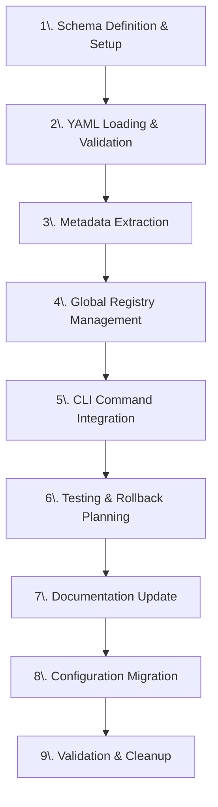

```mermaid
graph TD
    A[1\. Schema Definition & Setup] --> B[2\. YAML Loading & Validation];
    B --> C[3\. Metadata Extraction];
    C --> D[4\. Global Registry Management];
    D --> E[5\. CLI Command Integration];
    E --> F[6\. Testing & Rollback Planning];
    F --> G[7\. Documentation Update];
    G --> H[8\. Configuration Migration];
    H --> I[9\. Validation & Cleanup];
```
