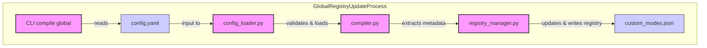

```mermaid
graph TD
    subgraph GlobalRegistryUpdateProcess
        CLI["CLI compile global"] -->|reads| ConfigYAML["config.yaml"]
        ConfigYAML -->|input to| ConfigLoader["config_loader.py"]
        ConfigLoader -->|validates & loads| Compiler["compiler.py"]
        Compiler -->|extracts metadata| RegistryManager["registry_manager.py"]
        RegistryManager -->|updates & writes registry| CustomModesJSON["custom_modes.json"]
    end

    classDef component fill:#f9f,stroke:#333,stroke-width:2px;
    classDef file fill:#ccf,stroke:#333,stroke-width:1px;

    class CLI,ConfigLoader,Compiler,RegistryManager component;
    class ConfigYAML,CustomModesJSON file;
```
