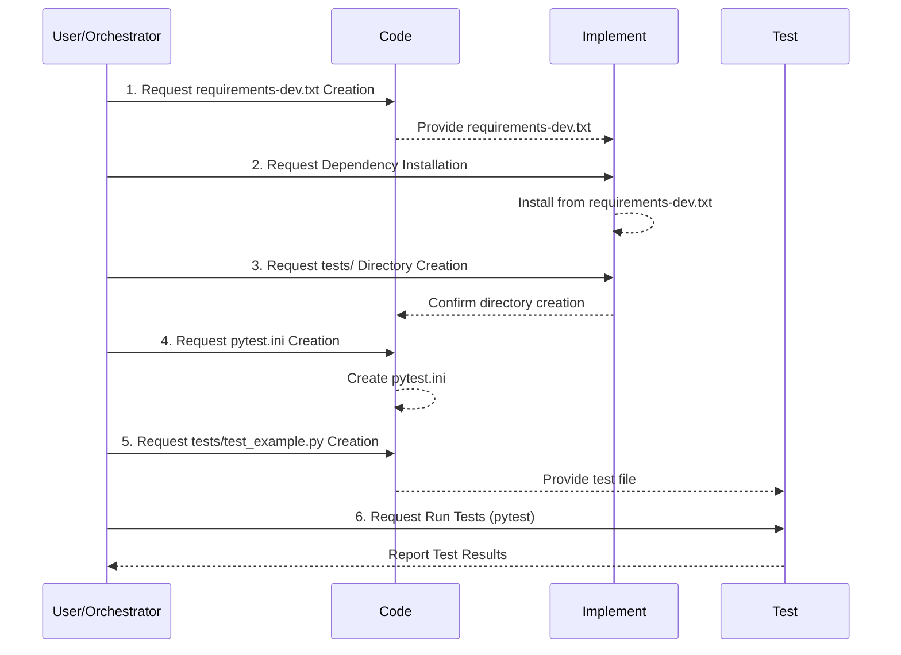

# Plan: Setting Up the `pytest` Testing Framework

This plan outlines the steps to integrate the `pytest` testing framework into the current project, considering its specific structure and lack of standard Python package management files.

**Goal:** Establish a basic, functional `pytest` setup for writing and running tests.

**Target File:** `ai/sessions/2025-04-08/pytest-setup/setup-test-suite-v2.md`

**Steps:**




1.  **Dependency Management (`requirements-dev.txt`)**
    *   **Action:** Create a new file named `requirements-dev.txt` in the project's root directory (`/Users/mateicanavra/Documents/.nosync/DEV/ai`).
    *   **Content:** Add the following lines to `requirements-dev.txt` to specify development and testing dependencies:
        ```
        pytest
        pytest-asyncio
        pytest-mock
        ```
    *   **Rationale:** Even without a primary `requirements.txt` or `pyproject.toml` for application dependencies, using `requirements-dev.txt` provides a standard way to manage testing-specific packages. This makes the setup reproducible and easier for others (or CI systems) to install the necessary testing tools.

2.  **Installation**
    *   **Action:** Install the testing dependencies using `pip`.
    *   **Command:** Open a terminal in the project root directory (`/Users/mateicanavra/Documents/.nosync/DEV/ai`) and run:
        ```bash
        python -m pip install -r requirements-dev.txt
        ```
        *(Note: Ensure a suitable Python environment/interpreter is active before running this command.)*
    *   **Rationale:** This installs `pytest` and the recommended plugins (`pytest-asyncio` for async code, `pytest-mock` for mocking) into the current Python environment.

3.  **Directory Structure (`tests/`)**
    *   **Action:** Create a new directory named `tests` in the project's root directory (`/Users/mateicanavra/Documents/.nosync/DEV/ai/tests`).
    *   **Rationale:** This is the conventional location for test code in Python projects, keeping tests separate from the main application code (`ai/`, `scripts/`). `pytest` automatically discovers tests in this directory by default.

4.  **Configuration (`pytest.ini`)**
    *   **Action:** Create a new file named `pytest.ini` in the project's root directory (`/Users/mateicanavra/Documents/.nosync/DEV/ai/pytest.ini`).
    *   **Content:** Add the following basic configuration:
        ```ini
        [pytest]
        testpaths = tests
        python_files = test_*.py *_test.py
        # Add asyncio mode if using pytest-asyncio extensively
        asyncio_mode = auto
        ```
    *   **Rationale:**
        *   `testpaths = tests`: Explicitly tells `pytest` where to look for tests.
        *   `python_files = test_*.py *_test.py`: Defines the naming convention for test files that `pytest` should discover.
        *   `asyncio_mode = auto`: Configures `pytest-asyncio` to automatically handle `async def` test functions.
    *   **Alternative:** If a `pyproject.toml` file is introduced later for other tooling, this configuration can be moved under the `[tool.pytest.ini_options]` section within that file.

5.  **Basic Test Example (`tests/test_example.py`)**
    *   **Action:** Create a simple placeholder test file within the `tests` directory: `/Users/mateicanavra/Documents/.nosync/DEV/ai/tests/test_example.py`.
    *   **Content:**
        ```python
        import pytest
        import asyncio # Required for the async example

        def test_initial_setup():
            """
            A simple test to verify that pytest is running correctly.
            """
            assert True

        # Example for an async test (requires pytest-asyncio)
        @pytest.mark.asyncio
        async def test_async_example():
            """
            A simple async test example.
            """
            await asyncio.sleep(0) # Replace with actual async logic later
            assert True

        # Placeholder - Import necessary modules from your project (e.g., ai/)
        # from ai.some_module import some_function

        # def test_some_functionality():
        #     # Replace with actual test logic for your project
        #     # result = some_function()
        #     # assert result == expected_value
        #     pass
        ```
        *(Note: You might need to adjust Python's `sys.path` or configure source paths if tests need to import modules from the `ai/` directory, potentially by adding an `__init__.py` to `tests/` and using relative imports or configuring `PYTHONPATH`.)*
    *   **Rationale:** This file serves as an initial check. If `pytest` can find and run this test successfully, the basic setup is confirmed.

6.  **Running Tests**
    *   **Action:** Execute tests using the `pytest` command.
    *   **Command:** Open a terminal in the project root directory (`/Users/mateicanavra/Documents/.nosync/DEV/ai`) and run:
        ```bash
        pytest
        ```
        Or, for more verbose output:
        ```bash
        pytest -v
        ```
    *   **Expected Outcome:** `pytest` should discover and run `test_initial_setup` and `test_async_example` from `tests/test_example.py`, reporting them as passing.

7.  **(Optional) CI Integration**
    *   **Concept:** Once the local setup is working, integrating testing into a Continuous Integration (CI) pipeline (e.g., GitHub Actions, GitLab CI) would typically involve:
        1.  Checking out the code.
        2.  Setting up the correct Python version.
        3.  Installing dependencies using `pip install -r requirements-dev.txt`.
        4.  Running tests using the `pytest` command.
    *   **Benefit:** Automates testing on every code change, ensuring regressions are caught early.

**Conclusion:**

Following these steps will establish a standard `pytest` testing environment within the project, enabling the development of unit, integration, and functional tests despite the absence of conventional Python packaging files.