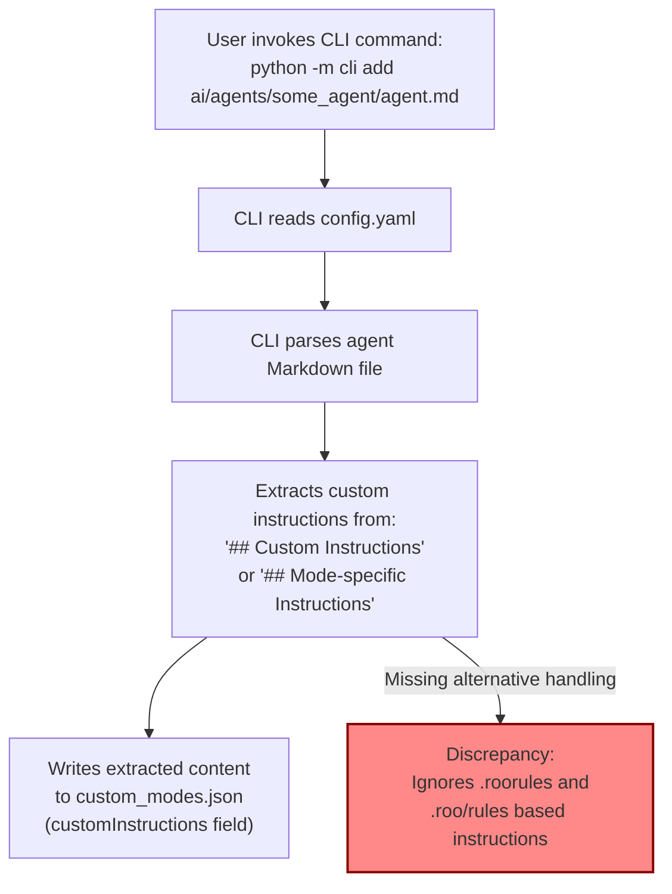

# Comprehensive Report: CLI Tool Adaptation for Roo Code Custom Instruction Changes

**Date:** 2025-04-10

## 1. Introduction & Objective

This report consolidates the findings and proposed plan resulting from an investigation into the impact of recent Roo Code configuration changes (specifically file-based custom instructions introduced in v3.11.8 and v3.11.9) on our internal `cli` tool. The objective was to understand the current state, identify discrepancies, and formulate a strategy to adapt the `cli` tool accordingly.

## 2. Research Findings: Roo Code Custom Instruction Evolution

Based on the analysis of Roo Code documentation (v3.11.8, v3.11.9, Custom Instructions/Modes features):

*   **File-Based Custom Instructions:** Roo Code introduced methods to manage custom instructions using files:
    *   **v3.11.8:** `.roorules` (workspace-wide) and `.roorules-{modeSlug}` (mode-specific).
    *   **v3.11.9:** Preferred directory structure: `.roo/rules/` (workspace-wide) and `.roo/rules-{modeSlug}/` (mode-specific), supporting multiple files loaded alphabetically.
*   **Loading Precedence:** The directory-based method (`.roo/rules/...`) takes precedence over the single-file method (`.roorules...`). Instructions from files/directories are combined with UI settings and the `customInstructions` property in the mode's JSON definition.
*   **Core Mode JSON Structure:** The fundamental JSON structure for defining custom modes (agents) in `custom_modes.json` or `.roomodes` appears unchanged regarding core properties like `slug`, `name`, `roleDefinition`, etc.
*   **Configuration Impact:** The primary impact is on *how custom instructions are sourced and assembled*. The new file/directory methods offer more flexible and version-controllable ways to manage instructions.

*(Source: `ai/sessions/2025-04-10/roo-config-upgrade/search_results.md`)*

## 3. Current State Analysis: CLI Tool & Repository Structure

### 3.1 Filesystem Structure

A scan of the `cli/` and `ai/` directories was performed to understand the relevant structures. Key findings include the layout of the `cli` tool's Python modules (`agent_config`, `main.py`, `config.yaml`) and the organization of agent definitions within the `ai/agents/` directory.

*(Detailed structure available in: `ai/sessions/2025-04-10/roo-config-upgrade/scan_results.md`)*

### 3.2 CLI Tool Custom Instruction Handling

Analysis of the `cli` tool's code revealed the following:

*   **Current Handling Mechanism:** The `cli` tool extracts custom instructions *solely* from the content under "## Custom Instructions" or "## Mode-specific Instructions" headings within an agent's primary Markdown definition file. This extracted text is mapped directly to the `customInstructions` key in the agent's JSON object (`custom_modes.json`).
*   **Comparison with Roo Code Research:** Recent Roo Code versions introduced file-based (`.roorules`, `.roo/rules/`) methods for custom instructions with a defined precedence order, combining instructions from multiple sources at runtime.
*   **Identified Gaps and Required Adaptation:**
    *   The current `cli` tool is **unaware** of the new file/directory-based custom instruction sources.
    *   It assumes the *only* source for the `customInstructions` JSON property is the agent's Markdown definition file.
    *   **Gap:** The CLI does not read or acknowledge `.roorules` files or `.roo/rules/` directories. The `customInstructions` value it writes represents only a *partial* view of the agent's actual instructions as interpreted by Roo Code.
    *   **Adaptation Needed:** The CLI's role concerning `customInstructions` needs re-evaluation to avoid creating incomplete and potentially misleading values.

### 3.3 Current Workflow & Discrepancy

The current workflow for adding/updating agent configurations via the CLI, highlighting the discrepancy with Roo Code's handling of custom instructions, is visualized below:

## 4. Proposed Adaptation Plan

Here is the proposed adaptation plan for the `cli` tool to align with Roo Code's updated custom instruction handling:

**1. Summary of Problem & Implications**
The `cli` tool currently extracts `customInstructions` only from the agent's Markdown file, ignoring Roo Code's newer file/directory-based instruction sources (`.roorules`, `.roo/rules/`). This leads to an incomplete and potentially misleading `customInstructions` value being written to `custom_modes.json`, misrepresenting the agent's full configuration as understood by Roo Code at runtime.

**2. Evaluated Options**

*   **Option A: Full Replication:** Modify the CLI to fully replicate Roo Code's logic (read Markdown, `.roorules`, `.roo/rules/`, respect precedence, combine content) and write the *complete* combined instructions to the `customInstructions` JSON field.
    *   *Pros:* `custom_modes.json` would contain the "effective" instructions.
    *   *Cons:* High complexity, duplicates Roo Code logic, potential for drift, large JSON field, obscures the source of instructions.
*   **Option B: Decoupling & Source Removal:** Modify the CLI to *stop* extracting/writing the `customInstructions` field altogether. Rely entirely on Roo Code's runtime assembly of instructions from Markdown, files, directories, and UI settings.
    *   *Pros:* Simplifies CLI logic, avoids logic duplication, single source of truth (Roo Code runtime), encourages use of file-based instructions.
    *   *Cons:* `custom_modes.json` no longer provides a preview of instructions; users must check files/directories.
*   **Option C: Partial Replication (Metadata Only):** Modify the CLI to detect the *presence* of `.roorules` or `.roo/rules/` and add metadata flags (e.g., `"hasFileBasedInstructions": true`) to the JSON, while still potentially extracting from Markdown (or maybe removing that too).
    *   *Pros:* Provides some indication in the JSON, less complex than Option A.
    *   *Cons:* Still potentially misleading if Markdown extraction remains, adds complexity over Option B.

**3. Recommended Strategy: Option B (Decoupling & Source Removal)**

Option B is recommended. It significantly simplifies the `cli` tool's responsibility regarding custom instructions, eliminates the risk of logic duplication and drift with Roo Code, and aligns with the apparent direction of Roo Code favoring file-based configuration for better management. While it removes the instruction preview from `custom_modes.json`, this is deemed an acceptable trade-off for correctness and maintainability. The source of truth becomes Roo Code's runtime interpretation.

**4. Detailed Adaptation Plan**

*   **A. CLI Code Modifications (`cli/agent_config/commands.py`, `cli/agent_config/markdown_utils.py`):**
    *   Remove the logic responsible for finding and extracting content under "## Custom Instructions" / "## Mode-specific Instructions" headers in `markdown_utils.py`.
    *   Remove the code in `commands.py` that populates the `customInstructions` field of the agent model before writing to JSON.
    *   Update any associated tests to reflect the removal of this functionality.
*   **B. Workflow Adjustments:**
    *   Communicate to users that custom instructions should primarily be managed via `.roorules` files or `.roo/rules/` directories alongside the agent's Markdown definition.
    *   Explain that the `cli` tool no longer attempts to consolidate these into the `custom_modes.json`.
    *   Update any internal documentation regarding the `cli` tool's behavior.
*   **C. Repository Structure Recommendations:**
    *   Encourage the adoption of the `.roo/rules-{modeSlug}/` directory structure for managing custom instructions for clarity and organization, placing these directories alongside the corresponding agent Markdown file (e.g., `ai/agents/some_agent/.roo/rules-some_agent/instruction1.md`).

**5. Trade-offs of Recommendation**

*   **Pro:** Simplification of `cli` tool, avoids logic duplication, aligns with Roo Code's direction, promotes better instruction management via files.
*   **Con:** Loss of instruction preview directly within `custom_modes.json`. Users need to inspect the filesystem (`.roorules`, `.roo/rules/`) to see file-based instructions.

## 5. Conclusion & Next Steps

The investigation confirms that the current `cli` tool's handling of custom instructions is incompatible with recent Roo Code updates that prioritize file-based instruction sources. The recommended approach (Option B) is to decouple the `cli` tool from managing the `customInstructions` JSON field, simplifying the tool and relying on Roo Code's runtime assembly as the single source of truth.

**Next Steps:**

1.  Implement the code modifications outlined in the Adaptation Plan (Section 4.A).
2.  Update relevant tests.
3.  Communicate the changes and new best practices for managing custom instructions to developers/users (Section 4.B).
4.  Update internal documentation for the `cli` tool.