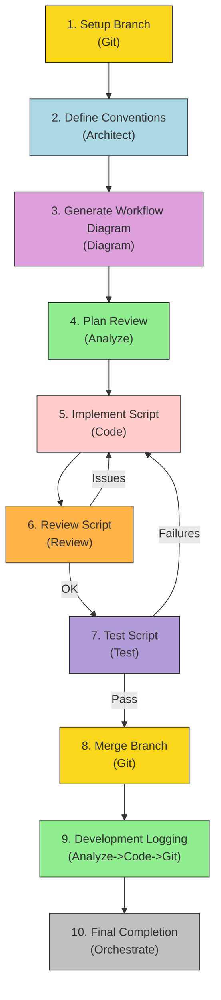

```mermaid
graph TD
    S1["1. Setup Branch<br/>(Git)"] --> S2["2. Define Conventions<br/>(Architect)"];
    S2 --> S3["3. Generate Workflow Diagram<br/>(Diagram)"];
    S3 --> S4["4. Plan Review<br/>(Analyze)"];
    S4 --> S5["5. Implement Script<br/>(Code)"];
    S5 --> S6["6. Review Script<br/>(Review)"];
    S6 -- Issues --> S5;
    S6 -- OK --> S7["7. Test Script<br/>(Test)"];
    S7 -- Failures --> S5;
    S7 -- Pass --> S8["8. Merge Branch<br/>(Git)"];
    S8 --> S9["9. Development Logging<br/>(Analyze->Code->Git)"];
    S9 --> S10["10. Final Completion<br/>(Orchestrate)"];

    %% Styling (Optional)
    classDef git fill:#f9d71c,stroke:#333,stroke-width:1px;
    classDef architect fill:#add8e6,stroke:#333,stroke-width:1px;
    classDef diagram fill:#dda0dd,stroke:#333,stroke-width:1px;
    classDef analyze fill:#90ee90,stroke:#333,stroke-width:1px;
    classDef code fill:#ffcccb,stroke:#333,stroke-width:1px;
    classDef review fill:#ffb347,stroke:#333,stroke-width:1px;
    classDef test fill:#b19cd9,stroke:#333,stroke-width:1px;
    classDef orchestrate fill:#c0c0c0,stroke:#333,stroke-width:1px;

    class S1,S8 git;
    class S2 architect;
    class S3 diagram;
    class S4,S9 analyze
    %% S9 involves multiple, but starts with Analyze
    class S5 code;
    class S6 review;
    class S7 test;
    class S10 orchestrate;
```